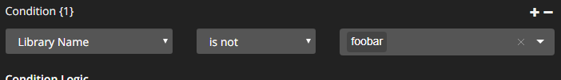

## Overview

Tautulli allows you to define conditions that determine whether or not your Notifications will actually be sent.

The conditions are used to _**allow**_ notifications through. For example:
  * Allow notifications through if the `Username` `is` `alice`.
  * Allow notifications through if the `Library Name` `is not` `4K Movies`

## Single conditions

The simplest use case is a single condition, allowing you to do things like not show Recently Added notifications for a specific library, or watched notifications for a specific user.

### Excluding a specific user


### Excluding a specific Library



### Custom Condition Logic

By default Tautulli uses `AND` to combine multiple conditions together, meaning that all conditions must evaluate to true in order for the notification to send. If you need more complex logic than that you can customize this in the _Condition Logic_ setting.

### Warning on `is not`

Don't try to use multiple `is not` clauses for the same parameter and join them together with an `OR`! This will simply end up with the combination evaluating to `True` every single time. 

For example let's say you have this setup:


* Play a song from `Music A`:
    ```
    {1} Library Name is not Music A = False
    {2} Library Name is not Music B = True
    Condition Logic = {False} or {True} = True = Notification is sent
    ```
* Play a song from `Music B`:
    ```
    {1} Library Name is not Music A = True
    {2} Library Name is not Music B = False
    Condition Logic = {True} or {False} = True = Notification is sent
    ```

If you want to use `is not` for multiple values simply put both values in the same value list within Tautulli:


## Conditions and Triggers

Conditions apply to the entire notification agent, this means that if you want to have some Triggers have one condition (Recently Added limited by library) and other Triggers limited by a different condition (Watched wasn't a specific user) you need to add different Notification Agents for the different triggers. Tautulli makes this simple to setup by providing a <kbd>Duplicate</kbd> button on each Notification Agent's dialog.

### ⚠️ Available properties

Note: Not all properties apply to all triggers!

If you open the list of parameter descriptions the sections will tell you when the properties are available for conditions, but there is nothing in the interface that will prevent you from setting things up incorrectly!

For example, the `{username}` property is only available for things related to a Stream such as the Watched or Playback triggers. It is _not_ available for things that have no stream details, such as the Recently Added trigger. If you set up a condition using a property that isn't available it's likely your notifications won't ever send!